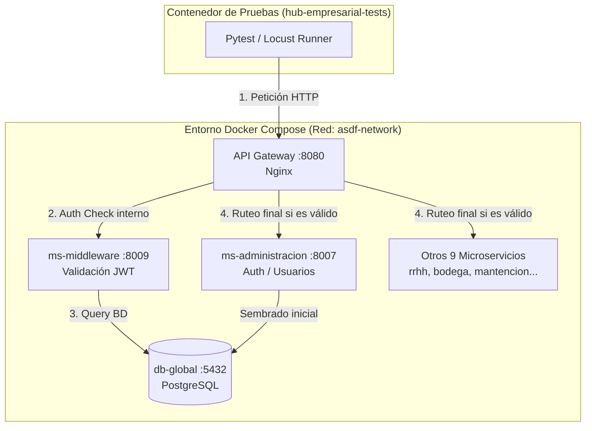

# Guía de Pruebas del Hub Empresarial (Suite Unificada)

Esta guía documenta la suite de pruebas del proyecto y explica la arquitectura interna del sistema para facilitar la comprensión de cómo interactúan las pruebas con los microservicios y el API Gateway.

---

## 1. Arquitectura del Sistema y Flujo de Red

El sistema es una plataforma compuesta por **11 microservices de Python (FastAPI/Quart)**, **11 módulos front-end (React/Vite)**, una base de datos **PostgreSQL** global, y un **API Gateway (Nginx)** orquestador.

El siguiente diagrama ilustra cómo fluyen las peticiones de prueba a través de la red de Docker:



### Flujo de Autenticación de la API:
1. **Petición del cliente**: Las peticiones de pruebas (de integración, Locust o E2E) atacan el puerto público del Gateway Nginx (`http://localhost:8080`).
2. **Filtro de Seguridad**: Nginx intercepta las rutas bajo `/api/v1/` y consulta mediante `auth_request` al microservicio `ms-middleware` (`/_auth_check`).
3. **Validación de Token**: `ms-middleware` decodifica la cabecera `Authorization: Bearer <token>` usando la clave secreta global (`JWT_SECRET`).
4. **Propagación de Identidad**: Si el token es válido, retorna HTTP `200` y Nginx inyecta las cabeceras `X-User-ID` y `X-User-Role` en la petición final antes de mandarla al microservicio destino (ej. `/api/v1/administracion/usuarios`).

---

## 2. Organización de la Carpeta de Pruebas

Los archivos de pruebas están ubicados en la carpeta [tests](file:///home/vicente/Escritorio/Archivos_Duoc/fullstack3-repo-maestro/tests):

*   [conftest.py](file:///home/vicente/Escritorio/Archivos_Duoc/fullstack3-repo-maestro/tests/conftest.py): Contiene las fixtures globales de Pytest y la configuración de bucles asíncronos.
*   [unit/](file:///home/vicente/Escritorio/Archivos_Duoc/fullstack3-repo-maestro/tests/unit/): Contiene los tests unitarios. Validan la lógica del helper de encriptación y validación de JWT en memoria sin requerir base de datos ni red.
*   [integration/](file:///home/vicente/Escritorio/Archivos_Duoc/fullstack3-repo-maestro/tests/integration/): Valida la integración de red del Gateway con los microservicios reales y que la base de datos responda correctamente.
*   [e2e/](file:///home/vicente/Escritorio/Archivos_Duoc/fullstack3-repo-maestro/tests/e2e/): Prueba de extremo a extremo que simula el flujo de negocio real (Login -> Adquisición de Token -> Uso del Token en Rutas Protegidas -> Rechazo de credenciales incorrectas).
*   [stress/](file:///home/vicente/Escritorio/Archivos_Duoc/fullstack3-repo-maestro/tests/stress/): Simulación de carga masiva de usuarios en paralelo contra los endpoints principales mediante Locust.

---

## 3. Comandos de Ejecución (`run_tests.sh`)

El script orquestador `./run_tests.sh` en la raíz del proyecto maestro automatiza la preparación del entorno. 

> [!TIP]
> Si el script detecta que Docker Compose está apagado, **lo levantará de forma autónoma, esperará mediante pings a que responda de forma saludable, correrá los tests y apagará los servicios limpiamente al finalizar**. Si ya estaba encendido, respetará tu sesión y lo dejará encendido.

---

### Comando 1: Ejecución Completa de la Suite
Corre consecutivamente todas las pruebas (Unitarias -> Integración -> E2E -> Carga de 10s).
```bash
./run_tests.sh all
```

---

### Comando 2: Pruebas Unitarias (Súper Rápidas)
Ejecuta los tests unitarios en memoria.
```bash
./run_tests.sh unit
```
*   **Ideal para:** Validar cambios de lógica locales de forma inmediata (tarda <1s). No requiere levantar Docker Compose.

---

### Comando 3: Pruebas de Integración
Valida la conectividad general de la API y el Gateway.
```bash
./run_tests.sh integration
```

---

### Comando 4: Pruebas de Negocio E2E
Ejecuta el flujo completo de autenticación y consumo de APIs protegidas.
```bash
./run_tests.sh e2e
```

---

### Comando 5: Pruebas de Estrés Headless (Ligero)
Corre una prueba de estrés de 10 segundos directamente en consola, reportando métricas sin cargar interfaz gráfica.
```bash
./run_tests.sh stress --headless
```

---

### Comando 6: Pruebas de Estrés Interactivas (Locust UI)
Levanta un servidor web en tu máquina local para definir curvas de usuarios y graficar en tiempo real.
1. Ejecuta:
   ```bash
   ./run_tests.sh stress
   ```
2. Entra en tu navegador a: [http://localhost:8089](http://localhost:8089)
3. En el formulario, ingresa:
   * **Number of users**: Ej. `50` (usuarios virtuales concurrentes).
   * **Spawn rate**: Ej. `5` (usuarios creados por segundo).
   * **Host**: `http://localhost:8080` (la dirección de nuestro Nginx).
4. Presiona **Start swarming**.
5. Para terminar, presiona `Ctrl + C` en tu consola para apagar el Locust y apagar el entorno automáticamente.

---

## 4. Optimizaciones del Contenedor de Pruebas

La suite de pruebas fue diseñada para ser lo más liviana posible en tu máquina:

*   **Imagen Única Consolidada (`hub-empresarial-tests`)**: En lugar de utilizar imágenes oficiales de Playwright de 1.5GB, construimos una basada en `python:3.11-slim` (~450MB) que tiene preinstaladas las dependencias de Chromium y librerías clave.
*   **Build Instantáneo con Caché**: El Dockerfile está estructurado de tal forma que las librerías (`requirements.txt` y binarios de Playwright) se instalan antes de copiar los archivos de código. Si modificas un archivo de test, la reconstrucción toma **menos de 5 segundos**.
*   **Evitación de Backtracking de pip**: Todas las dependencias conflictivas (FastAPI, Starlette) se encuentran pineadas en `requirements.txt`. El resolutor de dependencias de `pip` va directo a las versiones correctas.

---

## 5. Solución de Problemas Comunes

### Error: `401 Unauthorized` o `403 Forbidden` en E2E
*   **Causa**: Estás atacando una URL antigua como `/api/v1/auth/login` o `/api/v1/admin/usuarios` que no existen en los microservicios ni en la configuración de Nginx.
*   **Solución**: Los endpoints reales de este proyecto maestro son `/api/v1/administracion/login` y `/api/v1/administracion/usuarios`. Asegúrate de que tus pruebas utilicen estas rutas.

### Error: `Locust: executable file not found`
*   **Causa**: Falta compilar la imagen de Docker tras agregar la dependencia al archivo de requisitos.
*   **Solución**: Corre `./run_tests.sh build` para forzar a Docker a recompilar el entorno de pruebas con Locust instalado.

### Error: `Permission denied` en el script
*   **Causa**: El script de shell no tiene permisos en tu sistema operativo Linux.
*   **Solución**: Otorga permisos ejecutando en tu consola local:
    ```bash
    chmod +x run_tests.sh
    ```
